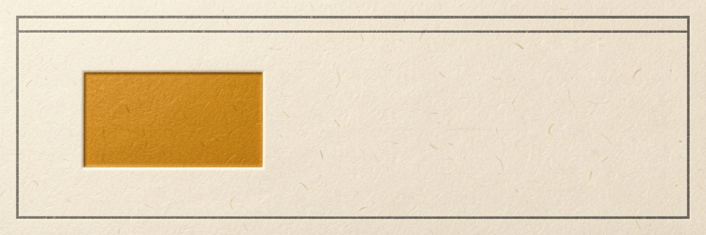

# Hello, I'm Dachi Gogotchuri

<picture>
  <source media="(prefers-color-scheme: dark)" srcset=".ai-engineering/images/profile-banner-dark/image-01.jpg">
  <source media="(prefers-color-scheme: light)" srcset=".ai-engineering/images/profile-banner/image-01.jpg">
  
</picture>

I am a general engineer. I build platforms, communities, and music.

## What I do

I lead as a **general engineer**: that framing is my decision, set in `dachi-gogotchuri-profile.md` section 3 on 2026-07-08, and it is wider than any single job title.

The current job is the backing fact: **Platform Governance Lead at Nationale-Nederlanden España** ([LinkedIn](https://www.linkedin.com/in/soydachi)). There I created the Platform Engineering team, led API governance and company-wide CI/CD standardization, and organize NN Tech Talks, 70+ talks so far.

I also founded **Arcasiles Group**, a cultural-tech platform in Vega Baja that spans tech, events, music, and community.

## Now

- Writing the monthly LinkedIn newsletter "Entre código y personas".
- Building AI engineering tooling in arcasilesgroup/ai-engineering.
- Running Arcasiles community events in Madrid and the Vega Baja.

## Contact

- Website: [soydachi.com](https://soydachi.com)
- LinkedIn: [linkedin.com/in/soydachi](https://www.linkedin.com/in/soydachi)
- Email: [info@arcasiles.com](mailto:info@arcasiles.com)
- Music: [@vegasoulband](https://instagram.com/vegasoulband) and [@jaleo.band](https://instagram.com/jaleo.band)
